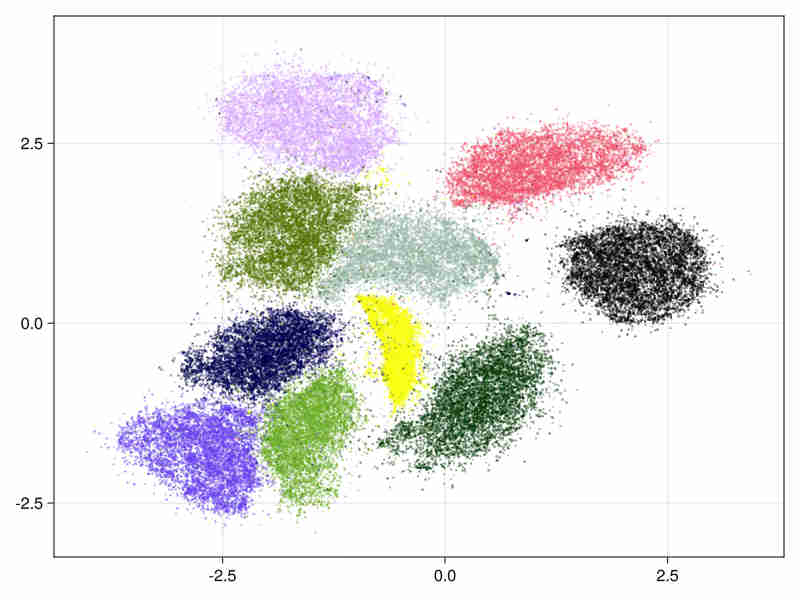
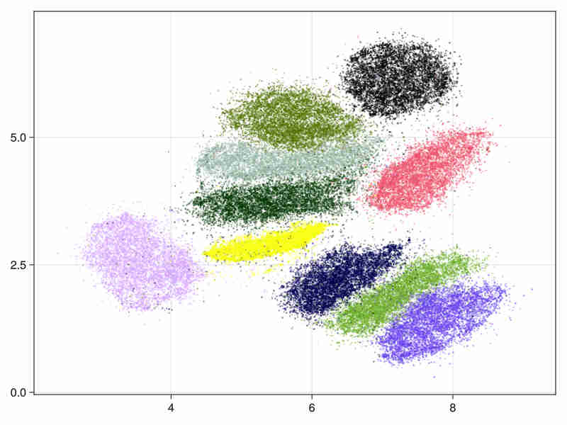
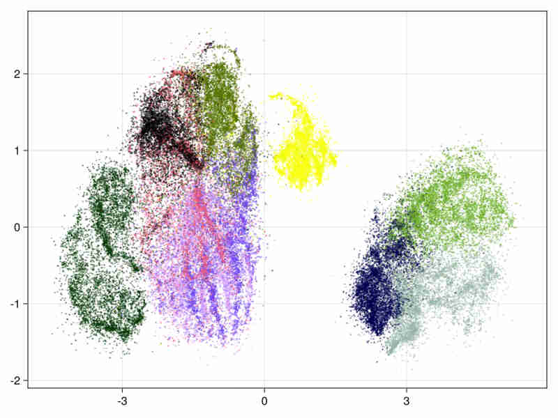
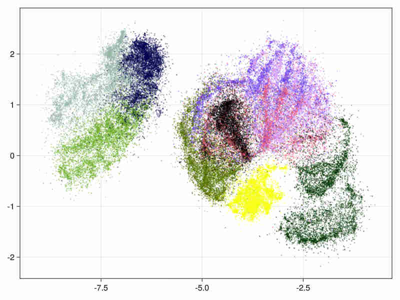
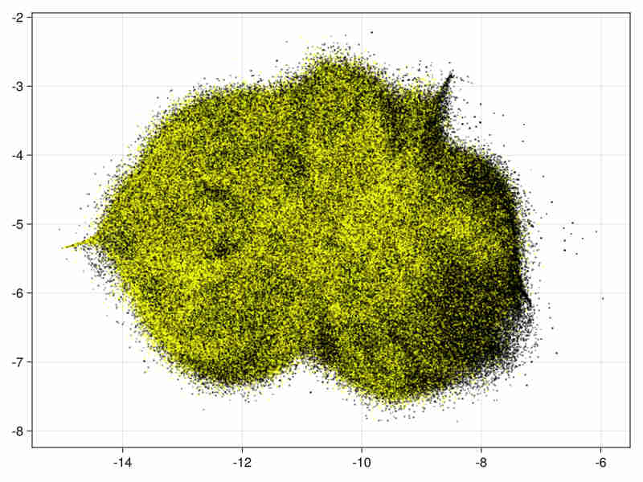
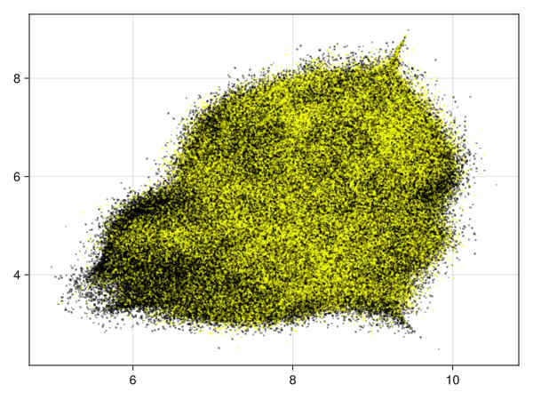
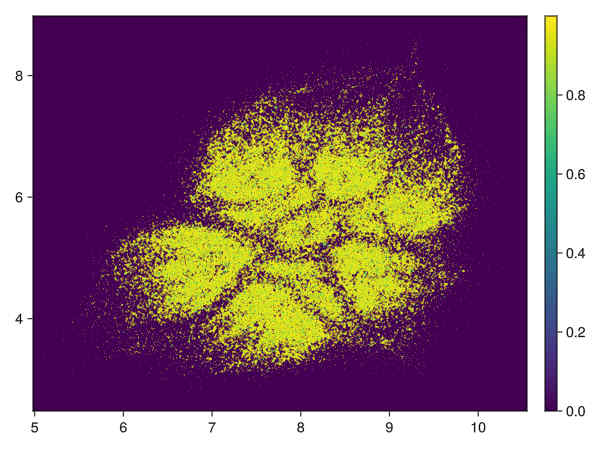
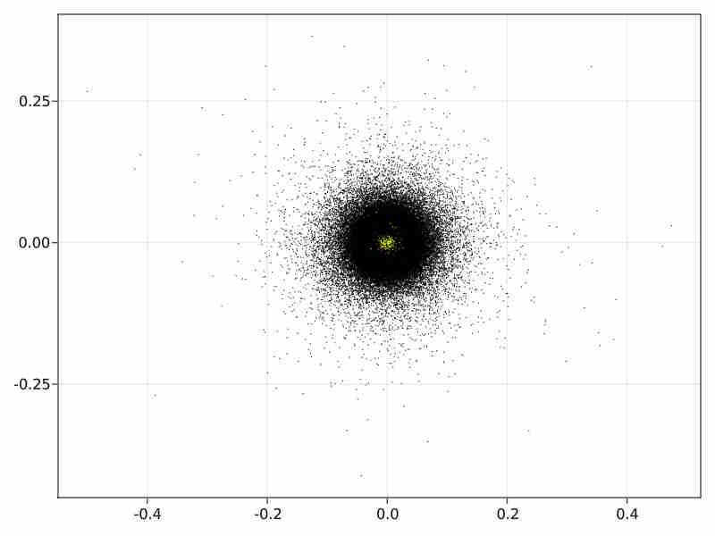

# A data embedding tool and related data analysis or clustering

The crate provides mainly in the form of a library (*See documentation of the binary embed for a small executable embedding data in csv files*):

1. Some variations on data embedding tools from t-Sne (2008) to Umap(2018).

   Our implementation is a mix of the various embedding algorithms mentioned in References.

- The graph is initialized by the Hnsw nearest neighbour algorithm as implemented in: [hnsw_rs](https://crates.io/crates/hnsw_rs).  
     This provides for free, sub-sampling in the data to embed by considering only less densely occupied layers (the upper layers). This corresponds generally to a subsampling of 2%-4%, but can give a guarantee as the distance beetween points leaved out the sampling and its nearest sampled neighbour are known. The hnsw structure thus enables also an iterative/hierarchical initialization of the embedding by taking into account an increasing number of layers.
  
- The preliminary graph built for the embedding uses an exponential function of distances to neighbour nodes (as in Umap),but keeps a    probability normalization constraint with respect to neighbours (as in T-sne).
    It is possible to modulate the initial edge weight by :
      - Considering a power of the distance function to neighbours (**See documentation in module EmbedderParams**).  
      - Increase or decrease the impact of the local density of points around each node. There is no symetrization of the graph. (except when initializing the embedding with diffusion maps in this case it is done as in t-sne or LargeVis). We use the diffusion maps algorithm (Lafon-Keller-Coifman).

- We also use a cross entropy optimization of this initial layout but take into account the initial local density estimate of each point when computing the cauchy weight of an embedded edge. The corresponding "perplexity" distribution is estimated on the fly. (**See documentation in module EmbedderParams**).

- We provide a tentative assesment of the continuity of the embedding to help selecting among varying results between runs for a given data set. This is detailed in the documentation of function *Embedder::get_quality_estimate_from_edge_length* and is illustrated in examples directory.

 1. Some by-products :

    - an implementation of range approximation and approximated SVD for dense and/or row compressed matrices as described in the svdapprox module and the paper of Halko-Tropp (Cf. [Tsvd](https://arxiv.org/abs/0909.4061)).

    - An estimation of the data intrinsic dimension as described in:  
            Levina E. and Bickel P.J NIPS 2004.  See [paper](https://www.stat.berkeley.edu/~bickel/mldim.pdf).

    - An estimation of the hubness of the graph of the Hnsw structure as described in:
            Radovanovic M., Nanopoulos A. and Ivanovic M. See [paper](https://www.jmlr.org/papers/volume11/radovanovic10a/radovanovic10a.pdf)
  
    - a Diffusion Maps implementation.

    - A link to the  Topological Data Analysis Julia package Ripserer.jl (See the directory Julia in the crate).  
    The distance matrix between points in a neighbourhood or from a reduced projected graph can be dumped to further processsing (see docs in module *fromhnsw::toripserer*).
    It is thus possible to produce persistence diagrams/barcodes of cloud points with the aid of the julia functions provided in the Julia directory of this crate (providing also visualization of the embedded data from the related csv files results).

## Building

### Blas choice 

 The crate provides 3 features to choose between openblas-static, intel-mkl-static or openblas-system as defined in the  **ndarray-linalg** crate.

 compile with :

- cargo build --release --features="openblas-static" to link statically with rust downloaded openblas
  
- cargo build --release --features="intel-mkl-static" to link with mkl intel's library
    (intel mkl will be automatically downloaded, see README.md of crate ndarray-linalg)

- cargo build --release --features="openblas-system" to link with system installed openblas library.
(In this case you must have an openblas library compiled with INTERFACE64=0, corresponding to 32bit fortran integers).

You can also add the feature you want in default features.

### simd 

On Intel cpu the you can add the **simdeez_f** feature to default features, or use the command **cargo build --release --features="openblas-system,simdeez_f"**.
On non intel cpu it is possible to use the **stdsimd** feature or  **"cargo build --release --features="openblas-system,stdsimd"**.   Note that **stdsimd** requires the nightly compiler.
## Julia

Julia scripts provide graphic functions.  
Julia can be downloaded from [julia](https://julialang.org/downloads/). Packages mentionned by a **using** clause in julia sources must then be installed see [Pkg](https://docs.julialang.org/en/v1/stdlib/Pkg/#Pkg). Then in a Julia REPL, **include("annembed.jl")** give access to functions Annembed.localPersistency and Annembed.projectedPersistency.
Possibly you will need to run *export LD_PRELOAD=/lib/x86_64-linux-gnu/libstdc++.so.6* or equivalent to force Julia to use your C++ library, due to subtle interaction between GPU drivers and GLFW.jl [see](https://discourse.julialang.org/t/makie-glfwerror/51006).

## Results

Timings are given for a 24-core (32 threads) i9 laptop with 64Gb memory.

### Embedder examples

Sources of examples are in corresponding directory.

1. **MNIST digits database**  Cf [mnist-digits](http://yann.lecun.com/exdb/mnist/)

    It consists in 70000 images of handwritten digits of 784 pixels

    - initialized by an approximated svd.

    It tooks 11s (system time) to run (cpu time 340s), of which 3s system time (100s cpu) were spent in the ann construction.

    

    - hierarchical initialization

    

    It took 11s to run (334s of cpu time) of which 3s were spent in the ann construction.

    - The estimated intrinsic dimension of the data is 18.5 with standard deviation depending on points: 7.2
    taking into account sorted neighbours around each point between the 9-th and 20-th first ranks.

2. **MNIST fashion database** Cf [mnist-fashion](https://github.com/zalandoresearch/fashion-mnist/tree/master/data/fashion)

    It consists in 70000 images of clothes.

    - initialized by an approximated svd.

    

    system time : 14s, cpu time 428s

    - hierarchical initialization
    (This is useful for large data embedding where we initialize the embedding with first layers above the deeper populated ones of the Hnsw structure to speed up the process).

    

    system time : 15s, cpu time 466s

    - The estimated intrinsic dimension of the data is 21.9 with standard deviation depending on points is 12.2, taking into account sorted neighbours around each point between the 9-th and 20-th first ranks.

3. **Higgs boson** Cf [Higgs-data](https://archive.ics.uci.edu/ml/datasets/HIGGS)

    It consists in 11 millions float vectors of dimension 28. First we run  on the first 21 columns, keeping out the last 7 variables constructed by the physicists to help the discrimination in machine learning tasks and then on the 28 variables.
    
    In both cases we use hierarchical initialization. 
    We run 200 batches in the first pass by using layers from layer 1 (included) to the upper layer. The first batches runs thus on about 460000 nodes. Then 40 batches are done on the 11 millions points. 
     
     Run times are in both cases around 2 hours (45' for the Hnsw construction and 75' for the entropy iterations)

    - Images for the 21 and 28 variables full data
 
        Quality estimation requires data subsampling due to the size of data (see examples and results). 
        Moreover a basic exploration of the data can be found in a Notebook at [Higgs.jl](https://github.com/jean-pierreBoth/Higgs.jl) to assess the quality of the embedding via random projections.

      21 variables image:

    

      28 variables image:
   
    

    - Quality estimation with a subsampling factor of 0.15

        Running with subsampling factor 0.15 on the data with 28 variables (1.65 million data points) we get in 16':

        *nb neighbourhoods without a match : 869192,  mean number of neighbours conserved when match : 5.449e0*

        So about half of the neighbourhoods are partially respected in the embedding.

        *quantiles on ratio : distance in embedded space of neighbours of origin space / distance of neighbours in embedded space*

        half of the original neighborhoods are embedded within a factor 1.30 of the radius of neighbourhood in embedded graph 

       *quantiles at 0.25 : 7.87e-2, 0.5 :  1.30e0, 0.75 : 4.75e0, 0.85 : 7.94e0, 0.95 : 1.62e1*        
        
       *the mean ratio is : 4.36*

    28 variables, subsampling 0.15:

    

    density of points obtained by transforming distance to first neighbour (See visu.jl):

    


    - Diffusion Maps initialization in the non hierarchical case.

        In the direct case the initial diffusion maps with approximated svd runs in 1650 sec and produces the following initialization image:

    

### Usage

```rust
    // allocation of a Hnsw structure to store data
    let ef_c = 50;
    let max_nb_connection = 70;
    let nbimages = images_as_v.len();
    let nb_layer = 16.min((nbimages as f32).ln().trunc() as usize);
    let hnsw = Hnsw::<f32, DistL2>::new(max_nb_connection, nbimages, nb_layer, ef_c, DistL2{});
    let data_with_id : Vec<(&Vec<f32>, usize)>= images_as_v.iter().zip(0..images_as_v.len()).collect();
    // data insertion in the hnsw structure
    hnsw.parallel_insert(&data_with_id);
    // choice of embedding parameters 
    let mut embed_params = EmbedderParams::new();
    embed_params.nb_grad_batch = 15;
    embed_params.scale_rho = 1.;
    embed_params.beta = 1.;
    embed_params.grad_step = 1.;
    embed_params.nb_sampling_by_edge = 10;
    embed_params.dmap_init = true;
    // conversion of the hnsw to a graph structure
    let knbn = 8;
    let kgraph = kgraph_from_hnsw_all(&hnsw, knbn).unwrap();
    // allocation of the embedder and embedding
    embedder = Embedder::new(&kgraph, embed_params);
    let embed_res = embedder.embed();
```

### Randomized SVD

The randomized SVD is based on the paper of [Halko-Tropp](https://epubs.siam.org/doi/abs/10.1137/090771806).
The implementation covers dense matrices or matrices in compressed row storage as provided in the *sprs* crate.

Two algorithms for range approximation used in approximated SVD are:

- *subspace_iteration_csr* , corresponds to algo 4.4 in Tropp paper. It uses QR stabilization.
  
- *adaptative_range_finder_matrep* correponds to algo 4.2 in Tropp paper.  The algorithm is less precise than *subspace_iteration_csr*  but can work on larger matrices for example on sparse matrices with a million rows.

## References

- Visualizing data using t_sne.
  Van der Maaten and Hinton 2008.

- Visualizing Large Scale High Dimensional Data
  Tang Liu WWW2016 2016 [LargeVis](https://arxiv.org/pdf/1602.00370.pdf)
  
- Phate Visualizing Structure and Transitions for Biological Data Exploration
  K.R Moon 2017.

- Umap: Uniform Manifold Approximation and Projection for Dimension Reduction.
  L.MacInnes, J.Healy and J.Melville 2018

- Stochastic Cluster Embedding.
  Zhirong Yang, Yuwei Chen, Denis Sedov, Samuel Kaski, Jukka Corander.   
  Statistics and Computing 2023. [SCE](https://link.springer.com/article/10.1007/s11222-022-10186-z)

## License

Licensed under either of

1. Apache License, Version 2.0, [LICENSE-APACHE](LICENSE-APACHE) or <http://www.apache.org/licenses/LICENSE-2.0>
  
2. MIT license [LICENSE-MIT](LICENSE-MIT) or <http://opensource.org/licenses/MIT>

at your option.
